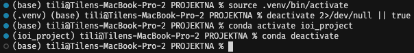

# Za začetek potrebujemo inštaliran python 3.10:

`kasnejše verzije ne podpirajo` openvisuspy in OpenVisus knjižnic, zato se moramo omejiti na 3.10 ali 3.11. Izbral sem si 3.10:

(testirano je bilo s python 3.10.16)

```bash
# Step 1: Deactivate current venv (if active)
deactivate 2>/dev/null || true

# Step 1 ALTERNATIVE: if using conda to manage environments
conda deactivate

# Step 2: Remove old virtual environment
rm -rf .venv

# Step 3: Create fresh virtual environment with Python 3.10
python3.10 -m venv .venv

# Step 4: Activate it
source .venv/bin/activate
# Note: After activation, `python3` will refer to the venv's Python 3.10

# Step 4 ALTERNATIVE (if using windows - it uses different name for "bin"):
source .venv/Scripts/activate

# Step 5: Check if the version of Python in the environment is 3.10.*
python3 --version

# Step 6: Upgrade pip, setuptools, and wheel first
python3 -m pip install --upgrade pip setuptools wheel

# Step 7: Install all requirements fresh
python3 -m pip install -r requirements.txt

# You are ready to go run the code in the .ipynb notebooks
```

# Additional content for step 1:
For step 1 the image below shows how the terminal window shows the active environment. After the environment deactivation step, you shold be on the "base" level, where the system uses the root python installation.



<b>IMAGE 1:</b> we start with no python environment. In the first line we tell the python to use the local environment, already created in the folder we are in, called `.venv`. In the second step, where we can se on the left side of the image, that we are using the `(.venv)` environment, we deactivate it using the `deactivate 2>/dev/null || true` command. After this we are back to the no environment, or in my case (macos) shown as `base`. After this we activate the anaconda distribution system environment, as this is a special case, which has its own deactivation command `conda deactivate`.


# Additional content for step 5:
we `update pip`, as this is the package installer, and should be up to date to be able to access the online package store. The `setuptools` and `wheel` is used to determine dependency packages needed by the packages that we are installing. The packages we are installing are written in the `requirements.txt` file. The only packages that have locked versions are the `OpenVisus` and `openvisuspy` package, as this the only problematic packages we have, and are responsible to handle access to the data.

# What NOT TO DO afte step 7:
some internet sources say that you should configure the OpenVisus upon installation, using `python3 -m OpenVisus configure` on windows or `CODE_SIGN=$(which codesign) python3 -m OpenVisus configure` on ARM macOS (Apple Sillicon). This should be <b>AVOIDED</b>, as this step does invalidate the binary inside the library, leading to invalidated signature. <b>This results in kernel crashing</b>.

